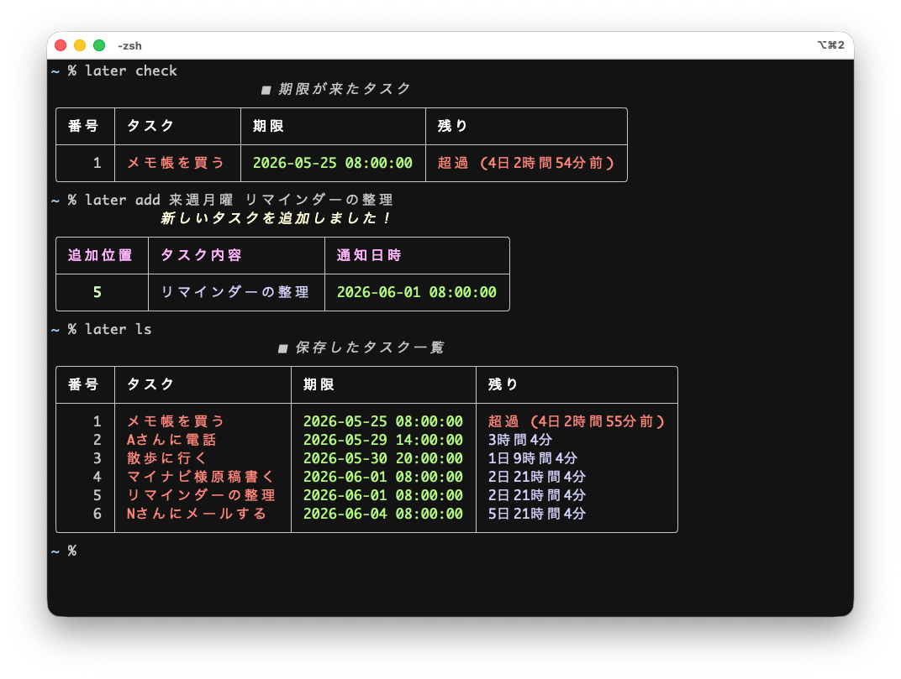

# later-cli

CLIでタスクを管理するシンプルなプログラムです。



- [簡単な使い方はこちら](./doc/README.md) をご覧ください。

## インストール

実行にはPython 3.10以降が必要です。

### GitHubリポジトリからインストール

パッケージマネージャーである [uv](https://github.com/astral-sh/uv) を使用してセットアップを行います。以下のコマンドを実行するだけで自動的に仮想環境（`.venv`）が構築され、依存関係の同期が完了します。

以下はuvをインストールするためのコマンドです。

```sh
# uvのインストール
pip install uv
# OR
# brew install uv
# cargo install --git https://github.com/astral-sh/uv uv
```

次いで、本プロジェクトのリポジトリをクローンして、依存関係をインストールします。

```sh
# リポジトリを取ってくる
git clone https://github.com/kujirahand/later-cli.git
cd later-cli

# 依存関係をインストールして同期
uv sync
```

### macOS/Linuxの場合

本リポジトリをcloneした後、パスにスクリプトのディレクトリを追加します。すると、`later args...` の形でどこからでも利用できます。
ラッパースクリプト `later` は、`.venv` が存在すれば自動的に `uv run` を経由して実行されます。

`~/.zshrc` や `~/.bashrc` に以下の設定を追加すると便利です。

```sh
LATER_CLI_PATH="/path/to/later-cli"  # later-cliのパスに置き換える
PATH="$LATER_CLI_PATH:$PATH"
# 起動時に期限の来たタスクをチェックする
later check
```

### Windowsの場合

WindowsのPowerShellを使う場合、ユーザーフォルダにある `~\Documents\WindowsPowerShell\Microsoft.PowerShell_profile.ps1` というファイル（`$PROFILE` の値）をテキストエディタで開いて、下記のような内容を追加します。なお、ファイルやフォルダがない場合は作成して追加する必要があります。

```powershell
cd /path/to/later-cli  # later-cliのパスに置き換える
uv run later.py check
```

## later の使い方

```text
Usage:
  later.py <command> [<args>...]

Commands:
  add           Add a new task. Example: later.py add "3d" "Submit report"
  a             Alias for add (shorter command)
  show          Show all tasks
  list          Alias for show
  ls            Alias for show (shorter command)
  delete        Delete a task by number. Example: later.py delete 1
  del           Alias for delete (shorter command)
  clear         Remove overdue tasks
  check         Show due tasks
  cal           Show weekly schedule in calendar format
  info          Show the data file path
  --file FILE   Use FILE as the task JSON file
  --help        Show this help message

Examples:
  later.py add "3d" "レポート提出"        # 3日後のタスクを追加
  later.py add "10h" "打ち合わせ"         # 10時間後のタスクを追加
  later.py add "今日" "今日のタスク"         # 本日の午前8時のタスクを追加
  later.py add "明日" "明日のタスク"        # 明日の午前8時のタスクを追加
  later.py add "明日20時" "明日20時"       # 明日20時のタスクを追加
  later.py add "明後日" "明後日のタスク"    # 明後日の午前8時のタスクを追加
  later.py add "来週" "来週のタスク"       # 来週の月曜日の午前8時のタスクを追加
  later.py add "来週月曜" "レポート提出"    # 来週の月曜日の午前8時のタスクを追加
  later.py add "水曜日" "ゴミ出し"         # 次の水曜日の午前8時のタスクを追加
  later.py add "来月第二月曜" "月次報告"    # 来月の第2月曜日の午前8時のタスクを追加
  later.py add "明日10時" "レポート提出"    # 明日の午前10時00分のタスクを追加
  later.py add "15:30" "打ち合わせ"        # 今日の15時30分（過ぎていれば明日）のタスクを追加
  later.py add "5/25" "テスト用タスク"       # (今年の) 5月25日（過去なら来年）の朝8時のタスクを追加
  later.py add "12月3日 15:30" "月次報告"     # 12月3日の15時30分のタスクを追加
  later.py add "2026-05-25" "テスト用タスク"   # 2026年5月25日の朝8時のタスクを追加
  later.py show                         # 全タスク一覧を表示
  later.py delete 1                     # 番号1のタスクを削除
  later.py clear                        # 期限切れタスクを削除
  later.py check                        # 期限切れタスクを表示
  later.py cal                          # 週間予定をカレンダー形式で表示
  later.py info                         # データの保存場所を表示
  later.py --file /tmp/tasks.json add now "テスト" # 指定したファイルにタスクを追加
```

## 開発者向け (just)

本プロジェクトではタスクランナーとして [just](https://github.com/casey/just) を導入しています。開発時のテストやコード品質の管理（Lint/Format）に利用できます。インストール方法は [justのGitHubリポジトリ](https://github.com/casey/just#installation) をご参照ください。

### justのコマンド一覧

プロジェクトのルートディレクトリで以下のコマンドを実行できます。

- **`just`** または **`just --list`**: 利用可能なコマンドの一覧を表示します。
- **`just install`**: 依存関係パッケージ（pytest, black, ruff 等）をインストールします。
- **`just test`**: `pytest` を使用してテストを実行します。
- **`just lint`**: `ruff` を使用してコードの静的解析（Linter）を実行します。
- **`just format`**: `black` および `ruff` を使用してコードを自動整形（Formatter）します。

## 詳しい使い方

以下のマイナビ様の連載で、プログラムの使い方や、プログラムの詳しい解説を掲載しています。

- https://news.mynavi.jp/techplus/article/zeropython-138/
