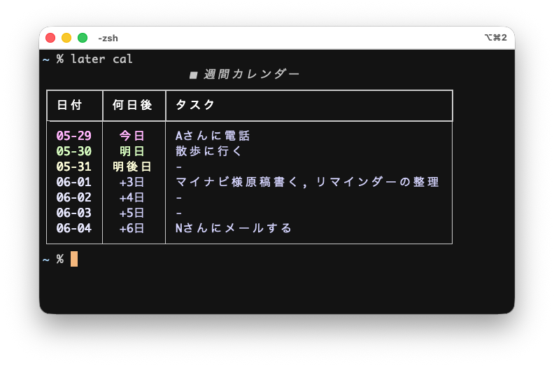

# Quick Start Guide for later-cli

`later-cli` is a simple CLI tool for managing tasks in your terminal. This guide explains the basic usage.

For installation instructions, please refer to [here](https://github.com/kujirahand/later-cli/).

## 0. Set Display Language

By default, the display language is English. If you want to change the display language to Japanese, run the following command:

```sh
later language ja
```

To set it back to English:

```sh
later language en
```

## 1. Adding Tasks

To add a task, use the `add` command (or its alias `a`).

```sh
# Easy offset format
later a 3d "Submit report"       # Adds a task for 3 days later at 8:00 AM
later a 10h "Meeting"            # Adds a task for 10 hours later

# Natural language format
later a "today" "Today's task"               # Adds a task for today at 8:00 AM
later a "tomorrow" "Tomorrow's task"         # Adds a task for tomorrow at 8:00 AM
later a "tomorrow 20:00" "Tomorrow 20:00"   # Adds a task for tomorrow at 8:00 PM
later a "day after tomorrow" "Task"          # Adds a task for the day after tomorrow at 8:00 AM
later a "next week" "Next week's task"       # Adds a task for next Monday at 8:00 AM
later a "next Monday" "Submit report"        # Adds a task for next Monday at 8:00 AM
later a "Wednesday" "Take out trash"         # Adds a task for next Wednesday at 8:00 AM
later a "next month second Monday" "Monthly report" # Adds a task for second Monday next month at 8:00 AM
later a "tomorrow 10:00" "Submit report"     # Adds a task for tomorrow at 10:00 AM

# Specific date/time format
later a "5/25" "Task contents"             # May 25th at 8:00 AM
later a "Dec 3 15:30" "Task contents"      # December 3rd at 3:30 PM
```

## 2. Viewing Tasks

To view your tasks in a table, use the `list` command (or its aliases `ls` or `show`).

```sh
later list
```

## 3. Deleting Tasks

To delete a task, use the `delete` command (or its alias `del`) followed by the task number displayed in the list.

```sh
later delete 1  # Deletes the 1st task in the list
```

## 4. Clearing Overdue Tasks

To clear all overdue tasks at once, use the `clear` command.

```sh
later clear
```

## 5. Checking Overdue Tasks

To display only the overdue tasks, use the `check` command.

```sh
later check
```

## 6. Calendar View for Weekly Schedule

To view your weekly schedule in a calendar format, use the `cal` command.

```sh
later cal
```



If you want to specify a custom number of days to display in the calendar, use the `--d` option:

```sh
# Display schedule for the next 30 days in calendar format
later cal --d 30
```

You can also use the shortcut command `later cal30` to quickly display a 30-day calendar view.

## 7. Checking Data File Location

To check the absolute file path where your task JSON data is saved, use the `info` command.

```sh
later info
```

## 8. Changing Task Status

To mark a task as "done", use the `done` command followed by the task number:

```sh
later done 1  # Marks the 1st task as done
```

To clear all completed (done) tasks at once, use the `clear --target=done` command:

```sh
later clear --target=done  # Clears all completed tasks
```

To mark a completed task back to "todo" (incomplete), use the `todo` command followed by the task number:

```sh
later todo 1  # Marks the 1st task as todo
```
